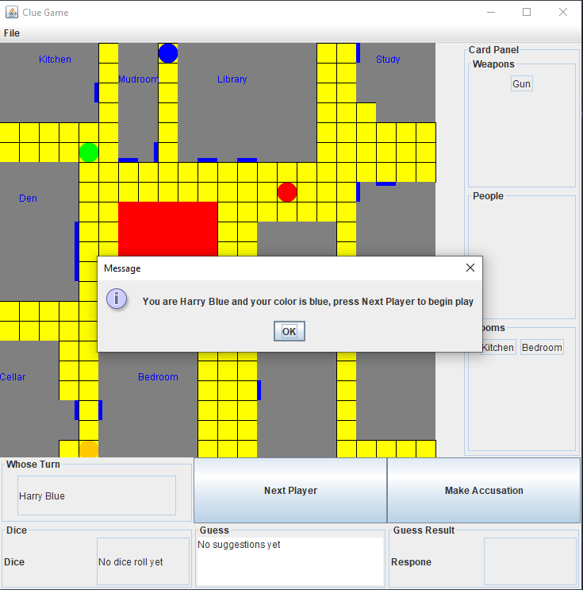

# Java Clue Game

A simple clue game written in Java using Eclipse. This project is for the CSCI306 ClueGame project at the Colorado School of Mines. 
## Usage
Download and run `cluegame.jar` and you should be presented with this view. Enjoy! 

## Authors

* **Nicholas Carnival** [Github](https://github.com/ncarn2)
* **Jordan Newport** [Github](https://github.com/jordannewport)
